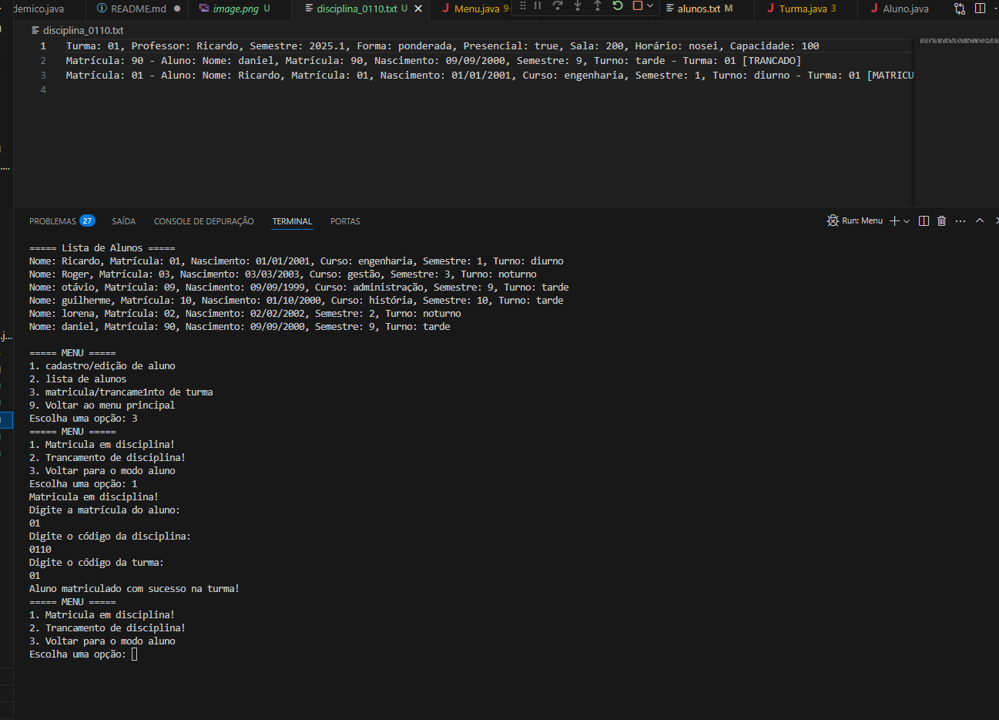
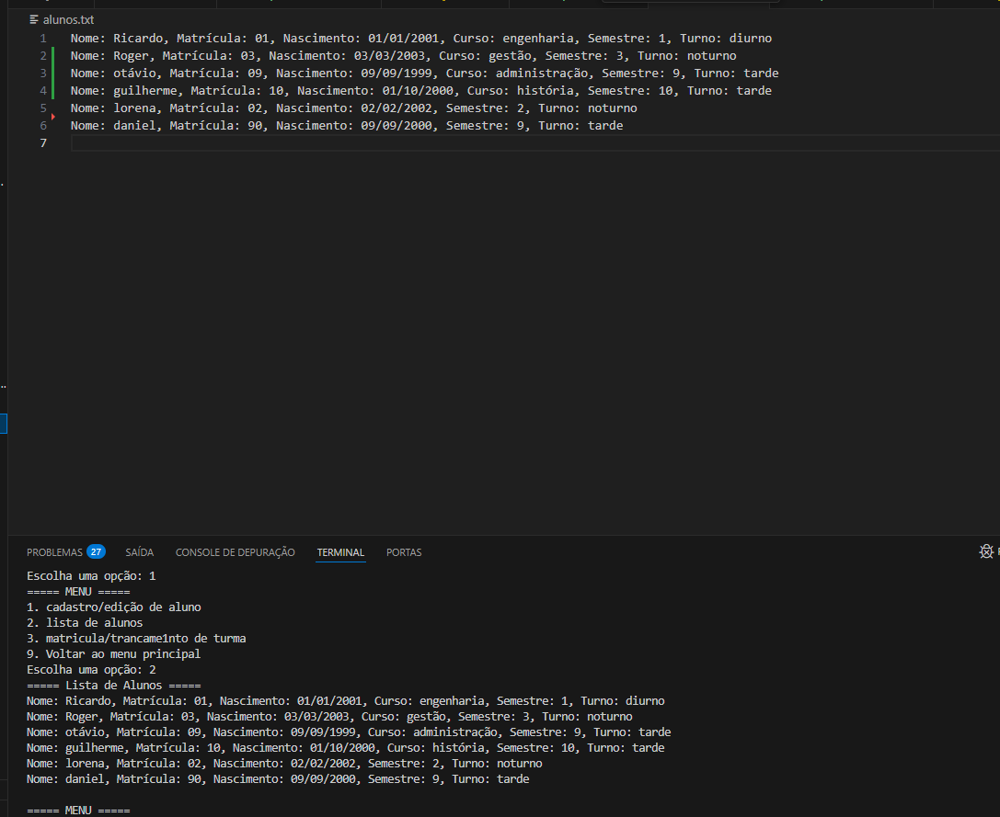
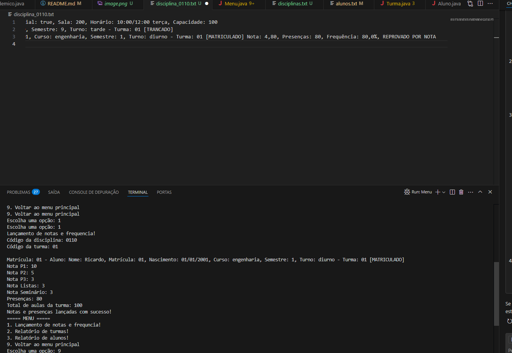

# Sistema Acadêmico - FCTE

## Descrição do Projeto

Desenvolvimento de um sistema acadêmico para gerenciar alunos, disciplinas, professores, turmas, avaliações e frequência, utilizando os conceitos de orientação a objetos (herança, polimorfismo e encapsulamento) e persistência de dados em arquivos.

O enunciado do trabalho pode ser encontrado aqui:
- [Trabalho 1 - Sistema Acadêmico](https://github.com/lboaventura25/OO-T06_2025.1_UnB_FCTE/blob/main/trabalhos/ep1/README.md)

## Dados do Aluno

- **Nome completo:** [Ricardo Eduardo da Silva Leal]
- **Matrícula:** [242015405]
- **Curso:** [Engenharia]
- **Turma:** [06]

---

## Instruções para Compilação e Execução

1. **Compilação:**  
   [Abra o terminal na pasta do projeto e execute: ```javac -d bin src/*.java```]

2. **Execução:**  
   [No terminal, execute: ```java -cp bin Menu```]

3. **Estrutura de Pastas:**  
   [Classes: Aluno.java , AlunoRegular.java , AlunoEspecial.java , Disciplina.java , Turma.java , RegistroAcademico.java Main: Menu.java Arquivos: alunos.txt # Dados dos alunos, disciplinas.txt # Dados das disciplinas,
    disciplina_XXXX.txt # Dados das turmas por codigo da disiplina]

3. **Versão do JAVA utilizada:**  
   [`java 21`]

---

## Vídeo de Demonstração

- [(https://www.youtube.com/watch?v=8ZHz358Q0og)]

---

## Prints da Execução

1. Cadastro de aluno na turma:  
   

2. Lista de Aluno:  
   

3. lancamento de notas:  
   

---

## Principais Funcionalidades Implementadas

- [x] Cadastro, listagem, matrícula e trancamento de alunos (Normais e Especiais)
- [x] Cadastro de disciplinas e criação de turmas (presenciais e remotas)
- [±] Matrícula de alunos em turmas, respeitando vagas e pré-requisitos
- [x] Lançamento de notas e controle de presença
- [x] Cálculo de média final e verificação de aprovação/reprovação
- [±] Relatórios de desempenho acadêmico por aluno, turma e disciplina
- [x] Persistência de dados em arquivos (.txt ou .csv)
- [x] Tratamento de duplicidade de matrículas
- [x] Uso de herança, polimorfismo e encapsulamento

---

## Observações (Extras ou Dificuldades)

- [Salvamento de dados, como organizar o código porque é o primeiro trabalho grande(o meu não ta nada organizado foi mal),falta de conhecimento de como fazer esse trabalho e como fazer um código decente]

---

## Contato

- [Ricardoeguiff@gmail.com]
